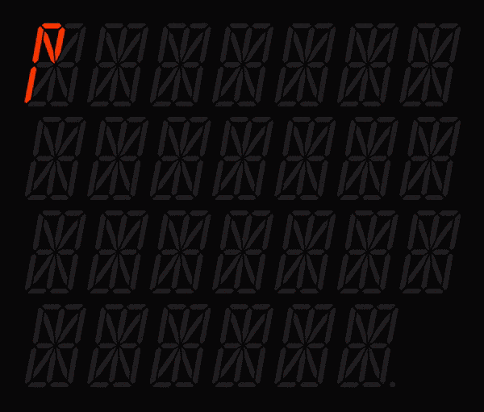

# 16seg



## Setup
This prototype installs [Parcel](https://github.com/parcel-bundler/parcel/).

Run the following commands and open the localhost URL Parcel provides in the CLI.
```sh
$ npm i
```

```sh
$ npm start
```

## How to use
### Static
```js
// Add the `16seg.svg` to your markup
// and select it.
const svg = document.querySelector('svg');

// Create the display passing in the SVG.
const display = createSegmentDisplay(svg);

// Show a letter on the display!
display.show('A');
```
## Animated
```js
const svg = document.querySelector('svg');

// Pass in optional options.
const display = createSegmentDisplay(svg, {
  loop: true,
  delay: 100,
});

// Ta-da!
display.showSequence(['A', 'B', 'C']);
```
